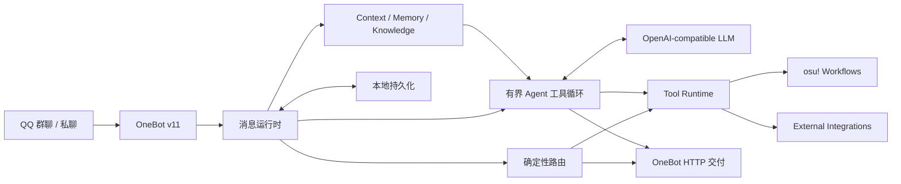

# WuxinBot

面向 QQ 群聊、基于 OneBot v11 的可扩展 AI Agent。

WuxinBot 把开放式对话、确定性消息路由和有边界的工具调用放进同一个运行时：明确命令与高置信度数据查询由代码直接处理，需要理解上下文或选择工具时才交给 LLM。它不是一个会无限规划和执行任务的 autonomous agent，也不只是把群消息原样转发给模型的聊天 Bot。

当前发行版默认使用 **pippi** 作为交互 persona；pippi 是表现层的人格设定，不是 WuxinBot 的项目定义。

## 为什么不只是普通 LLM Bot

- **确定性优先**：快捷命令和明确的 osu! 数据意图先经过代码路由，开放式问题再进入模型规划，避免把可验证操作交给提示词碰运气。
- **有界工具循环**：LLM 可以选择并连续调用结构化工具，但循环有明确的迭代上限；到达边界后会关闭工具并完成最终综合。
- **完整的工具续接**：工具结果会回到当前处理流程，模型可以依据真实结果继续分析和回复；可信的确定性结果也可以不经模型改写直接交付。
- **Adaptive Reasoning**：简单对话保持轻量；遇到上下文依赖、工具选择、目标歧义或失败恢复时，运行时可以提高推理强度，也可以通过总开关关闭。
- **可验证的 Agent Runtime**：Replay 与 Stateful Fuzz Harness 直接驱动生产使用的工具循环，检查有界执行、终态隔离、调用次数和确定性交付。

## 核心架构



消息由 OneBot WebSocket 进入运行时，经确定性路由或有界工具流程处理，再通过 OneBot HTTP 返回 QQ。运行配置、群聊状态、记忆和 osu! 绑定默认持久化到本地数据目录。

## 主要能力

### 群聊中的持续对话

WuxinBot 支持按群和成员设置交互策略，并把近期上下文、长期用户记忆、群聊关系以及可选知识库检索组装进对话上下文。persona 与这些运行时能力分离：默认是 pippi，也可以继续调整其交互风格，而无需改动消息路由和工具执行层。

### Tool-backed workflows

工具以明确的输入格式和允许操作范围接入。模型负责在开放问题中选择工具和组织回复；运行时决定哪些工具可以使用、何时停止以及交付什么结果。当前工具面以查询和 osu! 工作流为主，不提供任意文件、Shell 或电脑控制能力。

### osu! workflows

osu! 是 WuxinBot 当前最完整的垂直能力，但这里需要区分 **WuxinBot 自身的 osu! 运行层** 与 **可选的社区 Bot / 外部服务集成**。WuxinBot 并不是把所有 osu! 功能都从零重新实现了一遍。

#### WuxinBot 内部能力

WuxinBot 在自身运行时中提供统一的 osu! tool surface，并负责账号绑定、数据获取、分析、推荐和 Agent 调度。当前包括：

- QQ 与 osu! 账号绑定；
- 基于 osu! API v2 的玩家资料、BP 与 Recent 数据获取；
- 玩家综合分析、近期成绩对照与历史能力快照；
- BP 谱面类型分析；
- PP+ 与 skill 数据的统一查询和对话接入；
- 基于实际游玩数据的谱面推荐；
- multiplayer 比赛监听、回合事件推送与比赛 rating；
- 将上述能力作为结构化工具提供给 Agent，在需要真实 osu! 数据时由运行时调用。

其中谱面推荐系统由 WuxinBot 自身实现。部分能力还会使用独立的本地服务或上游组件，例如 PP+ 数据服务和图片渲染器；`match.ts` / `matchRating.ts` 的部分实现包含经过明确 attribution 的 YumuBot Apache-2.0 派生代码。

因此，这里的“内部能力”表示 **由 WuxinBot 仓库中的运行时统一提供和维护**，不表示所有算法、数据源和底层组件均由 WuxinBot 从零原创。

#### 可选社区 Bot 集成

WuxinBot 还支持连接独立运行的 osu! 社区 Bot：

- [YumuBot](https://github.com/yumu-bot/yumu-bot)（雨沐）
- [KanonBot](https://github.com/desu-life/Bot)（猫猫）
- [OsuQqBotForNewbieGroup](https://github.com/b11p/OsuQqBotForNewbieGroup)（消防栓 / Hydrant）
- [LazyBot](https://github.com/Apeuriox/lazybot-renewal)

这些项目均为独立软件，**其源码不包含在 WuxinBot 仓库中，也不属于 WuxinBot 本体**。WuxinBot 可以通过统一的工具接口和消息桥接调用它们，在用户明确指定某个 Bot 时也可以把请求交给对应的外部服务。

外部 Bot 并不是 WuxinBot 基本聊天和核心 Agent Runtime 的前置条件；没有部署这些服务时，WuxinBot 仍可使用自身已经配置完成的 osu! 数据与分析能力。具体可用功能取决于本地配置的数据源、渲染服务和外部集成。

LLM 主要负责理解请求、选择适当的工具以及解释结果。玩家资料、成绩、谱面、PP+、比赛数据等事实性信息来自实际 API、确定性计算或对应的外部服务，而不是由模型凭记忆生成。

## Quick Start

### 1. 准备运行环境

- Node.js（建议使用当前 LTS；仓库带有 portable Node 时优先使用它）
- 一个 OneBot v11 实现，例如 [NapCatQQ](https://github.com/NapNeko/NapCatQQ)
- DeepSeek 或其他 OpenAI-compatible LLM endpoint
- 可选：osu! OAuth Client Credentials，用于 osu! 工作流

### 2. 安装与配置

```bash
git clone https://github.com/GH-Wuxin/WuxinBot.git
cd WuxinBot
npm install
```

复制 [`.env.example`](./.env.example) 为 `.env`，填写 LLM API key，并按所用供应商配置 provider、endpoint 与 model：

```env
LLM_API_KEY=your_api_key
```

如需 osu! 功能，再填写 `OSU_CLIENT_ID` 与 `OSU_CLIENT_SECRET`。不要把 `.env` 或任何真实凭据提交到 Git。

### 3. 启动

```bash
npm run build
npm start
```

默认管理界面位于 `http://127.0.0.1:8787`。在界面中配置 OneBot WebSocket / HTTP 地址并连接；默认值分别为 `ws://127.0.0.1:3001` 和 `http://127.0.0.1:3000`。

Windows 下也可以使用仓库中的 `启动Wuxin.bat`、`停止Wuxin.bat` 和 `打开控制台.bat`。所有 QQ 指令及当前权限可见范围以群内 `/w help` 输出为准。

## 配置与文档

- [`.env.example`](./.env.example)：最小环境变量入口
- [`docs/EXTERNAL_INTEGRATION.md`](./docs/EXTERNAL_INTEGRATION.md)：OneBot、LLM、osu! OAuth、外部 Bot 与渲染器集成
- [`docs/KNOWLEDGE_BASE_V41.md`](./docs/KNOWLEDGE_BASE_V41.md)：知识库构建、开关、路由与验证

运行数据默认位于 Windows 的 `%APPDATA%\Wuxin\db.json`，可通过 `DATA_DIR` 改到其他目录。

## 开发与验证

```bash
npm run dev          # 同时启动服务端与 Vite 前端
npm run typecheck    # TypeScript 检查
npm run check        # 类型、构建、基础与安全验证
npm run verify-all   # 运行整库 verifier
npm run agent:replay # 重放 Agent runtime scenario
```

Replay Harness 使用 scripted LLM 和隔离 executor 驱动真实工具循环。它验证当前模型空间内的 runtime invariants，但不等价于真实 LLM 输出质量评估，也不证明生产环境不存在其他 race 或副作用问题。

## 项目边界

WuxinBot 属于 conversational agent，而非 autonomous agent。它不会在 QQ 对话之外自行设定目标，也不会无上限地规划、重试或执行任务。默认 persona 属于产品表现层；LLM 供应商可配置，知识库和外部 Bot 可选。OneBot 消息运行时与 bounded tool loop 才是项目的核心。

## License

WuxinBot 主体代码采用 [MIT License](./LICENSE)。

`server/osu/matchRating.ts` 与 `server/osu/match.ts` 包含派生自 [yumu-bot](https://github.com/yumu-bot/yumu-bot) 的 Apache-2.0 代码。来源、修改说明与许可证全文见 [THIRD_PARTY_NOTICES.md](./THIRD_PARTY_NOTICES.md) 和 [LICENSE.yumu-bot](./LICENSE.yumu-bot)。
