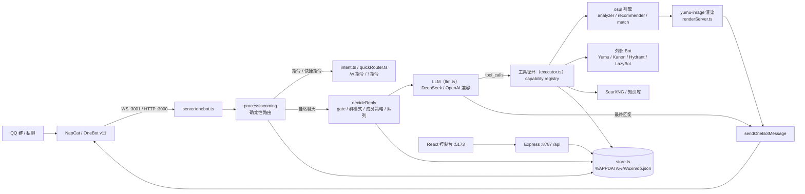

# WuxinBot

> 面向 QQ 群聊的可扩展 AI Agent，基于 OneBot，集成工具调用、长期记忆、
> osu! 工作流与外部 Bot 能力。

[](./LICENSE)
[](https://nodejs.org)
[](./tsconfig.json)

## WuxinBot 是什么

WuxinBot 不是一个单纯的 LLM 聊天壳。它以 QQ 群聊为主要的交互环境，
每条消息都会经过确定性的路由与决策层：先判断是自然聊天、管理指令还是
osu! 查询，再决定是否进入工具循环。模型可以调用真实工具（osu! API、
玩家分析、推图推荐、比赛监听、外部 Bot、搜索引擎），而不是凭记忆编造数据。

它的外显人格是 pippi——一个懂 osu!、活泼自信的少女。人格由
`persona.ts` / `prompt.ts` 构建，与记忆、群上下文、成员策略共同决定
每次回复，而不是把「人设」硬塞进每条消息。

osu! 是目前最完整的垂直能力：绑定账号、完整玩家分析、近期成绩短评、
基于真实 top 成绩的协同过滤推图、多人比赛观战，以及一批兼容社区习惯的
快捷指令。除此之外，它同样适合作为通用群聊机器人运行。

## 核心能力

### Agent Runtime

- 确定性路由 + LLM 决策：`processIncoming` 先走
  `intent.ts` / `quickRouter.ts` / `/w` 指令注册表，能确定处理的绝不交给模型；
  无法确定时才进入 LLM 工具选择。
- 工具循环：`executor.ts` 维护有界工具循环（默认最多 5 轮），支持多步
  工具调用、失败恢复与外部 Bot 响应超时；回复投递由独立队列负责。
- 推理路由：`reasoningRouter.ts` 按规则决定 `off / high / max` 推理档位，
  全量 shadow telemetry，仅记录结构化信号（不记录用户文本与工具载荷）。
- 快速失败：LLM 调用失败、超时或工具不可用时走确定性兜底，不静默吞错。

### 群聊与记忆

- 回复决策：每群独立模式（静默 / 仅 @ / 轻度参与 / 自然群友）、成员策略
  （管理员 / 信任 / 重点 / 少回应 / 黑名单）、频率上限与冷却、FIFO 回复队列。
- 长期记忆：个人画像 V3（证据账本制）、群聊氛围画像、群友关系画像与自动信任分，
  全部可审计（`profileLog.ts`）、可重算、可在 GUI 管理。
- 经验等级：无上限 pp 制（N 级 = N×100pp），`/w lv` / `/w top` / 自定义称呼
  与交互风格，升级由 pippi 生成个性化祝贺。
- 可观测：`/w why` 解释最近为什么回复或没回复；决策沙盒无需真实 QQ 消息即可测试。

### osu!

- 绑定：`/w osu bind <用户名>` 统一绑定，快捷指令共享同一账号。
- 分析：`/w osu analyze` 完整玩家分析（BP、PP+、技能维度与结论），
  `/w osu recent` 近期成绩短评，支持 std / taiko / catch / mania。
- 推图：基于真实 top 成绩的实时协同过滤（同分段玩家正在刷的图），
  自然语言筛选（BPM / AR / 星数 / mod）、冷却与 7 天防重复。
- 观战：`!ml` 多人比赛监听（内部 MatchListener，出图沿用雨沐渲染面板）；
  `!ra` 系列 rating（桥接雨沐原始 Bot）。
- 快捷指令：`!p` / `!bp` / `!bs` / `!s <BID>` / `!pp` / `!skill` / `!rec` /
  `荐图` / `~` / `查 @某人` / `/rd` 等。

### Integrations

- **OneBot v11**：NapCat（或其他兼容客户端）经 HTTP / WebSocket 接入，
  支持直接消息与合并转发。
- **LLM**：DeepSeek 或任意 OpenAI 兼容接口，可运行时切换供应商与模型，
  复杂任务自动升级更强模型。
- **外部 Bot 桥接**：Yumu / Kanon / Hydrant / LazyBot 各自运行 OneBot WS，
  Wuxin 作为第二客户端直连调用，未在线时回退内部实现。
- **渲染器**：yumu-image WebSocket 渲染谱面卡片与成绩图，不可用时降级文字。
- **搜索与知识**：可选 SearXNG 真实搜索；可选 BM25 三集合知识库
  （`wuxin_self` / `osu_domain` / `community_style`，默认关闭）。

## Architecture



## Quick Start

环境要求：Windows、Node.js 20+（推荐 22）、[NapCat](https://github.com/NapNeko/NapCatQQ)
或其他 OneBot v11 客户端、DeepSeek（或 OpenAI 兼容）API Key。

```bash
git clone https://github.com/GH-Wuxin/WuxinBot.git
cd WuxinBot
npm install
copy .env.example .env
```

至少填写：

```dotenv
LLM_PROVIDER=deepseek
LLM_API_KEY=你的Key
ADMIN_PASSWORD=控制台密码
```

启动：

```bash
npm run dev
```

打开 <http://127.0.0.1:5173>，在「QQ连接」页填入 HTTP / WebSocket 地址、
你的 QQ（owner）与 bot QQ，保存并连接。或先运行
`tools/enable-napcat-local-onebot.ps1` 写入本机 OneBot 配置，再双击
`启动Wuxin.bat`。

## Optional Integrations

- **osu! API**：在 osu! 官网 OAuth 页面创建应用，配置 `OSU_CLIENT_ID` /
  `OSU_CLIENT_SECRET`，启用 analyze / recent / recommend / match。
- **SearXNG**：配置本地 SearXNG 地址后，模型基于搜索结果回答，未配置时
  明确拒绝搜索请求。
- **Yumu / Kanon / Hydrant / LazyBot**：`BOTS_ROOT` 指向外部 Bot 部署目录，
  通过 `localBridge.ts` 直连调用；详见
  [docs/EXTERNAL_INTEGRATION.md](docs/EXTERNAL_INTEGRATION.md)。
- **yumu-image 渲染器**：配置 `YUMU_NODE` / `YUMU_DIR` 后启用图片输出，
  不可用时自动降级文字。
- **知识库（KB）**：`KB_ENABLED=false` 为启动级硬开关，默认关闭；设计见
  [docs/KNOWLEDGE_BASE_V41.md](docs/KNOWLEDGE_BASE_V41.md)。

## Configuration

完整环境变量见 [.env.example](.env.example)。关键项：

- `LLM_PROVIDER` / `LLM_API_KEY` / `LLM_API_BASE_URL` / `LLM_MODEL`：模型供应商。
- `ADMIN_PASSWORD`：设置后所有本地管理 API 均需认证。
- `DATA_DIR`：数据目录，默认 `%APPDATA%\Wuxin\db.json`。
- `OSU_CLIENT_ID` / `OSU_CLIENT_SECRET`：osu! API v2 client credentials。
- `BOTS_ROOT` / `YUMU_NODE` / `YUMU_DIR`：外部 Bot 与渲染器路径。

## Testing & Runtime Guarantees

```bash
npm run typecheck  # TypeScript 类型检查
npm run check      # 类型检查 + 构建 + 基础 / 安全验证
npm run sanity     # 基础集成测试
npm run security   # 安全验证
npm run verify-all # 全部验证脚本（60+ 个场景）
```

仓库还包含针对 Agent 行为的回归工具：

- `tools/agent-replay.ts`：回放真实消息轨迹，验证回复与工具调用一致。
- `tools/agent-counterfactual.ts` 与 `tools/agent-runtime/`：replay / stateful
  fuzz harness，验证有界执行、终态隔离（final 后不再调用 LLM / 工具 /
  业务效果）、确定性交付（payload exactly once、required tool exactly once）、
  工具调用计数、reasoning 单调性、trace 确定性与 harness 隔离等运行时不变量。
- 运行时保证：JSON 存储原子写入、OneBot 发送双重校验（HTTP 状态 +
  `status/retcode`）、LLM 超时与取消、知识库 fail-closed、命令冷却与
  权限门控全部有对应验证脚本。

## Documentation

- [docs/EXTERNAL_INTEGRATION.md](docs/EXTERNAL_INTEGRATION.md) — OneBot /
  LLM / osu! / 外部 Bot 桥接 / 渲染器部署指南
- [docs/KNOWLEDGE_BASE_V41.md](docs/KNOWLEDGE_BASE_V41.md) — 知识库架构与开关
- [CHANGELOG.md](CHANGELOG.md) — 更新日志

## License & Third-party Software

- WuxinBot 主体代码：MIT License，见 [LICENSE](./LICENSE)。
- `server/osu/matchRating.ts` 与 `server/osu/match.ts` 派生自
  [yumu-bot/yumu-bot](https://github.com/yumu-bot/yumu-bot)（Apache-2.0），
  来源 commit、修改说明与许可证全文见
  [THIRD_PARTY_NOTICES.md](./THIRD_PARTY_NOTICES.md) 与
  [LICENSE.yumu-bot](./LICENSE.yumu-bot)。
