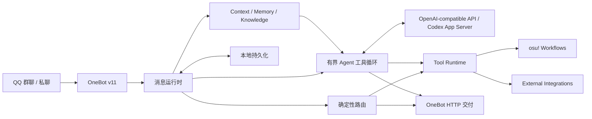

# WuxinBot

面向 QQ 群聊、基于 OneBot v11 的可扩展 AI Agent。

WuxinBot 把开放式对话、确定性消息路由和有边界的工具调用放进同一个运行时：明确命令与高置信度数据查询由代码直接处理，需要理解上下文或选择工具时才交给 LLM。它不是一个会无限规划和执行任务的 autonomous agent，也不只是把群消息原样转发给模型的聊天 Bot。

当前发行版默认使用 **pippi** 作为交互 persona；pippi 是表现层的人格设定，不是 WuxinBot 的项目定义。

## 为什么不只是普通 LLM Bot

- **确定性优先**：快捷命令和明确的 osu! 数据意图先经过代码路由，开放式问题再进入模型规划，避免把可验证操作交给提示词碰运气。
- **有界工具循环**：LLM 可以选择并连续调用结构化工具，但循环有明确的迭代上限；到达边界后会关闭工具并完成最终综合。
- **完整的工具续接**：工具结果会回到当前处理流程，模型可以依据真实结果继续分析和回复；可信的确定性结果也可以不经模型改写直接交付。
- **Adaptive Reasoning**：简单对话保持轻量；遇到上下文依赖、工具选择、目标歧义或失败恢复时，运行时可以提高推理强度，也可以通过总开关关闭。
- **可验证的 Agent Runtime**：Replay 与 Stateful Fuzz Harness 直接驱动生产使用的工具循环，检查有界执行、终态隔离、调用次数和确定性交付。

## 核心架构



消息由 OneBot WebSocket 进入运行时，经确定性路由或有界工具流程处理，再通过 OneBot HTTP 返回 QQ。运行配置、群聊状态、记忆和 osu! 绑定默认持久化到本地数据目录。

## 主要能力

### 群聊中的持续对话

WuxinBot 支持按群和成员设置交互策略，并把近期上下文、长期用户记忆、群聊关系以及可选知识库检索组装进对话上下文。persona 与这些运行时能力分离：默认是 pippi，也可以继续调整其交互风格，而无需改动消息路由和工具执行层。

对于只需要 osu! 功能的群，可以使用 `/w mode osu` 启用硬隔离模式：普通消息不会进入 LLM、聊天上下文、群画像或玩家画像，只处理 osu! 确定性指令和退出该模式所需的管理命令。

### Tool-backed workflows

工具以明确的输入格式和允许操作范围接入。模型负责在开放问题中选择工具和组织回复；运行时决定哪些工具可以使用、何时停止以及交付什么结果。当前工具面以查询和 osu! 工作流为主，不提供任意文件、Shell 或电脑控制能力。

### osu! workflows

osu! 是当前最完整的垂直能力：

- QQ 与 osu! 账号绑定和玩家档案；
- BP、Recent、PP+ 与谱面类型分析；
- 单图九维 Skill Profiler，以及经过成绩质量和名次衰减修正的 BP50 长期玩家画像；
- `/w skill recent` 近期状态画像与 `/w skill compare` 玩家能力对比；
- 基于实际游玩数据的谱面推荐；
- multiplayer 监听、回合事件推送与比赛 rating。

LLM 负责解释和表达，玩家数据、成绩、星数与工具结果来自实际接口或确定性计算。外部 Bot 和图片渲染属于可选集成，不是核心运行时的前置条件。

## Quick Start

### 1. 准备运行环境

- Node.js 22 或更高版本（当前验证基线为 Node.js 22；本地存在 portable Node 时优先使用它）
- 一个 OneBot v11 实现，例如 [NapCatQQ](https://github.com/NapNeko/NapCatQQ)
- DeepSeek / 其他 OpenAI-compatible endpoint，或已登录个人 ChatGPT 的 Codex CLI
- 可选：osu! OAuth Client Credentials，用于 osu! 工作流

### 2. 安装与配置

```bash
git clone https://github.com/GH-Wuxin/WuxinBot.git
cd WuxinBot
npm ci
```

复制 [`.env.example`](./.env.example) 为 `.env`，按所用供应商配置 provider、endpoint 与 model。传统 API 模式填写：

```env
LLM_API_KEY=your_api_key
```

也可以在管理界面的“模型与推理设置”中选择“个人 ChatGPT / Codex 额度”，完成官方 ChatGPT 登录后直接使用 Codex 配额；无需把登录令牌写入 WuxinBot。该模式会保留当前 API 模型作为自动降级通道。详见 [`docs/CODEX_CHATGPT_PROVIDER.md`](./docs/CODEX_CHATGPT_PROVIDER.md)。

如需 osu! 功能，再填写 `OSU_CLIENT_ID` 与 `OSU_CLIENT_SECRET`。不要把 `.env` 或任何真实凭据提交到 Git。

### 3. 启动

```bash
npm run build
npm start
```

默认管理界面位于 `http://127.0.0.1:8787`。在界面中配置 OneBot WebSocket / HTTP 地址并连接；默认值分别为 `ws://127.0.0.1:3001` 和 `http://127.0.0.1:3000`。

Windows 下如需在后台重启服务，可使用正式维护脚本：

```powershell
powershell -NoProfile -ExecutionPolicy Bypass -File .\tools\restart-wuxin.ps1
```

如需为已有 NapCat 实例启用本地 OneBot HTTP/WS，可运行：

```powershell
powershell -NoProfile -ExecutionPolicy Bypass -File .\tools\enable-napcat-local-onebot.ps1
```

所有 QQ 指令及当前权限可见范围以群内 `/w help` 输出为准。

## 配置与文档

- [`.env.example`](./.env.example)：最小环境变量入口
- [`docs/EXTERNAL_INTEGRATION.md`](./docs/EXTERNAL_INTEGRATION.md)：OneBot、LLM、osu! OAuth、外部 Bot 与渲染器集成
- [`docs/KNOWLEDGE_BASE_V41.md`](./docs/KNOWLEDGE_BASE_V41.md)：知识库构建、开关、路由与验证

运行数据默认位于 Windows 的 `%APPDATA%\Wuxin`。`db.json` 保存小型核心状态，消息、画像、决策、遥测与 Skill Profiler 记录分别写入独立 shard；可通过 `DATA_DIR` 改到其他目录。备份接口仍导出一份完整的逻辑数据库 JSON。

## 开发与验证

```bash
npm run dev          # 同时启动服务端与 Vite 前端
npm run typecheck    # TypeScript 检查
npm run check        # 类型、构建、基础与安全验证
npm run verify-all   # 运行整库 verifier
npm run agent:replay # 重放 Agent runtime scenario
```

Replay Harness 使用 scripted LLM 和隔离 executor 驱动真实工具循环。它验证当前模型空间内的 runtime invariants，但不等价于真实 LLM 输出质量评估，也不证明生产环境不存在其他 race 或副作用问题。

## 项目边界

WuxinBot 属于 conversational agent，而非 autonomous agent。它不会在 QQ 对话之外自行设定目标，也不会无上限地规划、重试或执行任务。默认 persona 属于产品表现层；LLM 供应商可配置，知识库和外部 Bot 可选。OneBot 消息运行时与 bounded tool loop 才是项目的核心。

## License

WuxinBot 主体代码采用 [MIT License](./LICENSE)。

`server/osu/matchRating.ts` 与 `server/osu/match.ts` 包含派生自 [yumu-bot](https://github.com/yumu-bot/yumu-bot) 的 Apache-2.0 代码。来源、修改说明与许可证全文见 [THIRD_PARTY_NOTICES.md](./THIRD_PARTY_NOTICES.md) 和 [LICENSE.yumu-bot](./LICENSE.yumu-bot)。
